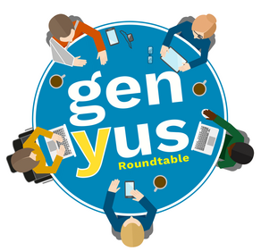

<p align="center">
    
</p>
<br>

# Genyus Roundtable

Genyus Roundtable is a part of the offerings of the Genyus Network. Roundtable is an online peer-led focus group where people with shared commonalities and traits can discuss research which directly involves their broader peer groups in a fun and empowering way.

## Contributors

<table>
    <tr>
        <td align="center">
            <a href="https://bitbucket.cis.unimelb.edu.au:8445/plugins/servlet/user-contributions/haichaos?view=summary">Haichao Song</a>
            <br>
            <p align="center">:computer:</p>
        </td>
        <td align="center">
            <a href="https://bitbucket.cis.unimelb.edu.au:8445/plugins/servlet/user-contributions/kaixuang?view=summary">Kaixuan Guo</a>
            <br>
            <p align="center">:computer:</p>
        </td>
        <td align="center">
            <a href="https://bitbucket.cis.unimelb.edu.au:8445/plugins/servlet/user-contributions/liguoc?view=summary">Liguo Chen</a>
            <br>
            <p align="center">:computer:</p>
        </td>
        <td align="center">
            <a href="https://bitbucket.cis.unimelb.edu.au:8445/plugins/servlet/user-contributions/yujuny?view=summary">Yujun Yan</a>
            <br>
            <p align="center">:computer:</p>
        </td>
    </tr>
</table>

## Supervisor

<table>
    <tr>
        <td align="center">
            <a href="https://bitbucket.cis.unimelb.edu.au:8445/projects/SWEN900142020WSECHIDNA/repos/swen90014-2020-ws-echidna/browse">Peter Eze</a>
            <br>
            <p align="center">:computer:</p>
        </td>
    </tr>
</table>

## Project Structure
```
root
 |-- public
 |      - the website landing page is here
 |-- src
 |      - all the source codes are here
 |-- package.json
        - contains information about the project, e.g. project metadata and project dependencies

```
